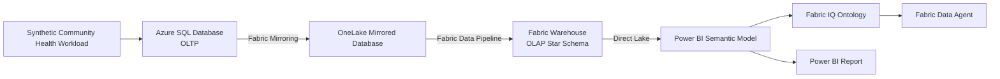

# Azure SQL to Microsoft Fabric Data Agent

An end-to-end demonstration of a public-health analytics solution that moves synthetic transactional data from Azure SQL Database into Microsoft Fabric and makes governed business concepts available through a Fabric Data Agent.

> [!IMPORTANT]
> The compliant Azure foundation and Fabric workspace/gateway are deployed. Completion
> is blocked on a pre-existing tenant service principal credential for private Azure SQL
> access; no policy bypass or out-of-scope identity was created.

## Scenario

The demonstration is designed for a community and public-health context. It will show how operational information about appointments, encounters, referrals, programs, facilities, and service outcomes can flow from an OLTP system into a governed analytical and AI experience.

The sample data will be entirely synthetic. This repository must not contain real patient information, protected health information (PHI), credentials, or production connection strings.

## Starter Application

The Python 3.12 FastAPI service generates a deterministic, non-identifying
community-health dataset in memory. It deliberately has no cloud database client
and does not model names, addresses, contact details, clinical notes, or other
direct identifiers.

### Run locally

Create and activate a virtual environment, then install the application dependencies:

```powershell
py -3.12 -m venv .venv
.\.venv\Scripts\Activate.ps1
python -m pip install -r requirements.txt
Copy-Item .env.sample .env
uvicorn main:app --host 0.0.0.0 --port 8000
```

Environment variables in `.env.sample` document the deterministic seed, record
count, reference date, CORS origins, and listening port. Uvicorn does not load
`.env` automatically; set those variables in the shell when overriding defaults.
For a Linux production process, use:

```text
gunicorn -w 4 -k uvicorn.workers.UvicornWorker main:app --bind 0.0.0.0:${PORT:-8000}
```

Available endpoints:

- `GET /healthz` — liveness response (`200 {"status":"ok"}`)
- `GET /readyz` — in-memory dataset readiness (`200`, or `503` if unavailable)
- `GET /api/v1/synthetic-data` — deterministic synthetic dataset
- `GET /docs` — interactive OpenAPI documentation

## Architecture



### Azure

The planned Azure resource group is:

```text
rg-e2e-sql-to-fabricagent
```

It is expected to contain:

- An Azure SQL logical server
- An Azure SQL Database
- The identity and network configuration required for Fabric Mirroring
- Optional diagnostic settings

Additional Azure services will be introduced only if they are required by the final implementation.

### Microsoft Fabric

A dedicated Fabric workspace will contain:

- An Azure SQL mirrored database
- A Fabric Warehouse
- A Fabric Data Pipeline
- A Direct Lake semantic model
- A Power BI report
- A Fabric IQ Ontology
- A Fabric Data Agent

The workspace will use an existing F8 Fabric capacity. The capacity can be paused when the environment is not in use to limit cost.

## Planned Data Model

The synthetic operational model is expected to include:

- Clients represented by synthetic identifiers
- Demographic groups and age bands
- San Francisco analysis neighborhoods
- Facilities and service programs
- Appointments and encounters
- Referrals and referral outcomes
- Service categories
- Facility capacity

The analytical model will convert the normalized operational data into dimensions and facts suitable for population-health and service-access analysis.

## Example Measures

Planned governed measures include:

- Unique clients served
- Encounters per 1,000 residents
- Appointment completion rate
- No-show rate
- Median appointment wait time
- Referral completion rate
- Median referral completion time
- Program capacity utilization
- Follow-up within 30 days
- Service-access differences by neighborhood

## Example Agent Questions

The completed Fabric Data Agent should support questions such as:

- How many clients received services this quarter, by program?
- Which service categories have the longest median appointment wait times?
- How has referral completion changed over the last six months?
- Which facilities are operating above 85 percent of planned capacity?
- Which neighborhoods have lower service utilization after adjusting for population?
- Where do residents experience both longer wait times and longer travel distances?

## Privacy and Responsible AI

Privacy and governance are core requirements of the demonstration:

- Use synthetic data only.
- Do not store real PHI or directly identifying information.
- Exclude unstructured clinical notes from the initial scope.
- Enforce least-privilege access through Microsoft Entra ID.
- Apply disclosure controls below the agent layer.
- Use approved aggregate measures and demographic groupings.
- Suppress or withhold small populations according to an approved policy.
- Do not rely on agent instructions as a security boundary.
- Clearly distinguish synthetic demonstration patterns from real public-health findings.
- Treat associations as descriptive rather than causal.

Any production adaptation must undergo organizational privacy, security, legal, data-governance, and responsible-AI review.

## Planned Repository Structure

The repository will evolve toward the following layout:

```text
.
|-- infra/                  # Azure infrastructure as code
|-- src/community_health/   # Synthetic data API and local data layer
|-- main.py                 # ASGI entry point
|-- requirements.txt        # Python production dependencies
|-- database/
|   |-- schema/             # Azure SQL OLTP schema
|   |-- seed/               # Synthetic sample data
|   `-- workload/           # Transaction workload generator
|-- fabric/
|   |-- warehouse/          # OLAP schema and transformations
|   |-- pipeline/           # Pipeline definitions
|   |-- semantic-model/     # Semantic model artifacts
|   |-- ontology/           # Ontology documentation or artifacts
|   `-- data-agent/         # Agent configuration and evaluations
|-- tests/                  # Data, privacy, and deployment tests
|-- docs/                   # Architecture and operational guidance
`-- README.md
```

This structure is provisional and will be adjusted to match the deployment and source-control capabilities of the selected Fabric items.

## Delivery Plan

- [x] Define naming, region, networking, and access conventions
- [x] Create Azure infrastructure as code
- [x] Create the Azure SQL OLTP schema
- [x] Create a deterministic local synthetic-data starter service
- [ ] Load synthetic community-health data into Azure SQL
- [x] Configure Fabric capacity and a dedicated workspace
- [ ] Configure Azure SQL Mirroring
- [ ] Create the Fabric Warehouse and transformation pipeline
- [ ] Build the Direct Lake semantic model
- [ ] Create the Power BI demonstration report
- [ ] Generate and curate the Fabric IQ Ontology
- [ ] Create and configure the Fabric Data Agent
- [ ] Add privacy, permission, data-quality, and agent evaluation tests
- [ ] Document deployment, demonstration, and shutdown procedures

## Cost Management

The deployment will create billable Azure and Microsoft Fabric resources. The implementation should:

- Use an appropriately sized Azure SQL Database for demonstration data.
- Reuse the approved existing Fabric capacity.
- Pause the Fabric capacity when it is not needed.
- Avoid unnecessary supporting services.
- Document resource cleanup and shutdown procedures.

## Deployment Status

**Azure foundation deployed; Fabric data path blocked by an identity prerequisite.**

Deployed in the approved boundary:

- Resource group `rg-e2e-sql-to-fabricagent`
- Entra-only Azure SQL server `sql-e2e-fabricagent-dev-3af2`
- S3 database `sqldb-community-health`
- Private VNet, SQL private endpoint, private DNS, and delegated Fabric gateway subnet
- Key Vault `kv-e2e-fabric-3af2`
- Fabric workspace `ws-e2e-sql-to-fabricagent`
- Fabric VNet data gateway `gw-e2e-sql-to-fabricagent`

The tenant's MCAPS policies enforce both Entra-only authentication and private-only
Azure SQL networking. Fabric's VNet Data Gateway rejects OAuth2 user credentials for
Azure SQL (`OAuth2CredentialsNotSupportedForConnection`) and requires Basic or
service-principal credentials. Basic authentication is prohibited by the Entra-only
policy. Creating a new Entra application or service principal would be outside the
approved resource-group/workspace boundary, so deployment stopped rather than bypassing
governance.

To continue, supply an existing tenant service principal's client ID, object ID,
display name, and secret to `scripts/Deploy-Fabric.ps1`. The script securely accepts the
secret as a `SecureString`, configures that principal as the Entra-only SQL administrator,
creates the private Fabric connection, initializes the synthetic schema/data, and proceeds
with the remaining Fabric items.

The F8 capacity was paused after the deployment attempt. application validation; infrastructure, database, and
Fabric implementation have not started.
